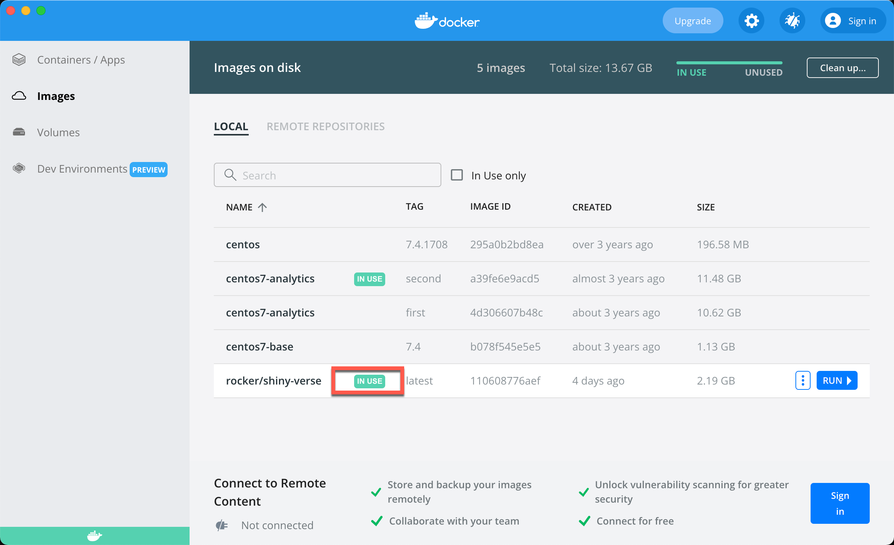
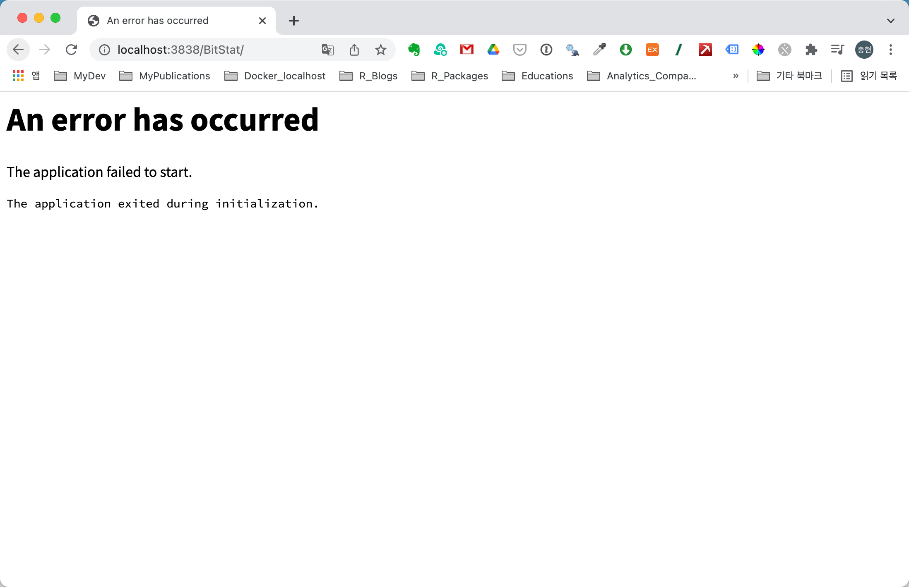

```{r setup, include=FALSE}
knitr::opts_chunk$set(echo = TRUE, 
                      message = FALSE, 
                      warning = FALSE, 
                      collapse = FALSE,
                      fig.align = "center")

library(shiny)
library(htmltools)

xaringanExtra :: use_panelset()
```


```{r Dockerfile, echo=FALSE, out.width = "50%"}
knitr::include_graphics("img/docker-container.png")
```
삽화출처: [초보를 위한 도커 안내서 - 도커란 무엇인가?](https://subicura.com/2017/01/19/docker-guide-for-beginners-1.html)

```{r, preface, echo=FALSE}
div(class = "preface", 
    h4("들어가기"),
    "컨테이너 환경설정이라 말하고 실행만 합니다. ", br(),
    "docker 컨테이너를 실행하는 옵션을 GUI 화면에서 어렵게 시도합니다.", br(),
    "CLI에서는 간단한 것을? 그러나 전문가가 아니니까요. Docker Desktop을 애용한답니다.")
```

<br>

## docker 컨테이너 환경 설정하기
우리는 Shiny 데모 애플리케이션을 실행하기 위해서 Shiny 서버를 설치하지는 않을 것입니다. Shiny 데모 애플리케이션이 구동되는 최소 환경은 "아 Shiny 애플리케이션이 서버가 docker 환경에서 실행되는 구나" 정도를 인지할 뿐, 사용자가 개발한 애플리케이션을 운영하기 위해서는 몇가지 작업을 수행해야 합니다.  

우리는 **오픈통계 패키지인 BitStat를 Shiny 서버에서 운영하는 것을 전제로 Shiny 서버의 docker 환경을 설정**할 것입니다.

docker를 업무에, 혹은 자주 사용하지 않는 관계로 docker에 정통하지는 않습니다. 아주 기본적인 지식만 가지고 있을 뿐이죠. (명령어를 줄줄이 외울 정도로 잦은 주기의 docker 작업을 수행하지 않기 때문에) 그래서 개인적으로 Mac OS에서 **Docker Desktop**라는 Docker 관리 애플리케이션을 사용하고 있습니다. 
이 글은 Docker Desktop을 이용하는 방법을 위주로 작성합니다. 하지만 docker 명령어도 간간히 병기하여 설명하도록 합니다.

## Shiny 서버 환경 설정하기

Shiny 서버에서 BitStat 애플리케이션을 운영하기 위해서는 다음과 같은 추가적인 환경설정 작업이 필요합니다. 

* 애플리케이션을 배포할 경로 설정 
  - BitStat 애플리케이션이 위치할 경로 설정
* 애플리케이션 수행시 발생하는 로그 경로 설정
  - 애플리케이션 운영의 안정성을 위한 Shiny 서버 로그 
* 애플리케이션이 실행에 필요한 R 패키지 설치
  - rocker/shiny-verse 이미지에 누락된 R 패키지 설치

## 포트와 볼륨 설정
rocker/shiny-verse 이미지에는 BitStat 애플리케이션이 포함되어 있지 않습니다. 그러므로 BitStat 애플리케이션을 docker 컨테이너에 호스트의 볼륨(Volumes)으로 탑재해야 합니다.

그리고 docker 컨테이너 안에서의 수행하는 Shiny 애플리케이션의 로그를 호스트에서도 확인하기 위해서 로그를 쌓을 볼륨도 설정해야 합니다. 
**특히 모든 리소스들이 정확하게 설치되어 문제없이 애플리케이션이 실행되기 전까지는 이 로그의 역할이 매우 중요**합니다. 트러블슈팅(Troubleshooting)의 실마리를 제공해주는 유일한 환경이기 때문입니다.

Shiny 서버는 3838 포트를 사용합니다. 여기서도 Shiny 서버의 기본 포트인 3838을 사용합니다. 

### Docker Desktop 활용
Docker Desktop의 이미지 목록의 'NAME' 컬럼에 'rocker/shiny-verse'이 리스트업 되었습니다. 


포트와 볼륨 설정을 위해서 **'RUN 버튼'**을 눌러서 컨테이너 정의 다이얼로그를 엽니다. 그러면 다음과 같은 'New Container' 다이얼로그가 나타납니다. 이 화면에서 바로 'Run 버튼'누르지 말고 **'Optional Settings'**를 선택합니다. 


이 **Optional Settings 다이얼로그 창**에서 다음처럼 포트와 볼륨설정을 정의합니다.

[docker hub 사이트의 rocker/shiny 페이지](https://hub.docker.com/r/rocker/shiny)를 참고하여 옵션을 설정합니다.

* Container Name: shiny-server
* Ports:
  - Local Host: 3838
  - Container Port: default
* BitStat 애플리케이션 Path
  - Host Path: BitStat 애플리케이션이 있는 호스트 경로
  - Container Path: /srv/shiny-server
* BitStat 애플리케이션 Path
  - Host Path: Shiny 서버 로그를 저장할 호스트 경로
  - Container Path: /var/log/shiny-server  

설정한 후 'Run 버튼'을 누르면 Shiny 서버 컨테이너가 실행됩니다. 


이미지 목록 화면에서 'rocker/shiny-verse'의 **'INUSE'** 버튼을 누릅니다.



그러면 다음처럼 'rocker/shiny-verse' 이미지에서 실행된 컨테이너 목록을 확인할 수 있습니다. 목록을 보면 **'shiny-server'**라는 이름의 컨테이너가  3838 포트로 실행중임을 알 수 있습니다. 


### 콘솔 명령어 사용

Docker Desktop을 사용하지 않는다면, 다음의 명령어로도 간단하게 'rocker/shiny' 이미지를 실행할 수 있습니다.

```{r, eval=FALSE, echo=TRUE}
docker run -d -p 3838:3838 --name shiny-server \
    -v /Users/choonghyunryu/shiny-server/:/srv/shiny-server/ \
    -v /Users/choonghyunryu/Documents/99_logs/shiny/:/var/log/shiny-server/ \
    rocker/shiny
```

## BitStat 애플리케이션 실행
이제는 http://localhost:3838 URL로 Shiny 서버 데모가 실행되지 않습니다. Shiny 서버의 홈 디렉토리 호스트의 경로로 변경했기 때문입니다. 이제는 이  URL은 다음과 같은 화면을 출력합니다.

로컬 호스트의 /Users/choonghyunryu/shiny-server/ 디렉토리에는 서브 디렉토리로 BitStat 애플리케이션이 위치하기 때문입니다.


화면에서 BitStat 링크를 클릭하거나  http://localhost:3838/BitStat/ URL로 BitStat 애플리케이션을 실행할 수 있습니다.

그러나 다음처럼 에러가 발생했습니다. 



에러가 발생한 원인을 호스트의 로그 볼륨에서 확인할 수 있습니다. 호스트의 /Users/choonghyunryu/Documents/99_logs/shiny 디렉토리에 있는 로그 파일을 열어봅니다.


docker 컨테이너에 shinyjs 패키지가 설치되어 있지 않았기 때문에 에러가 발생한 것입니다. 'rocker/shiny-verse' 이미지에는 이 패키지가 포함되어 있지 않기 때문입니다.


## 결언

docker 컨테이너에 호스트의 애플리케이션 경로와 로그 경로를 연결하고, 포트를 설정했습니다. 그러나 'rocker/shiny-verse' 이미지에 필요한 R 패키지가 없어서 서비스가 정상적으로 구동되지 않았습니다.

컨테이너 안에 필요한 R 패키지를 설치해야 합니다.


