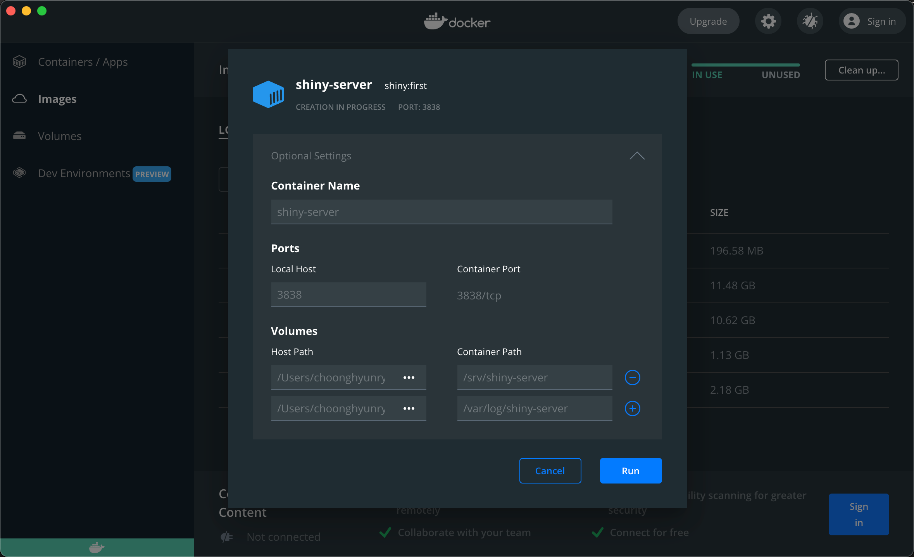
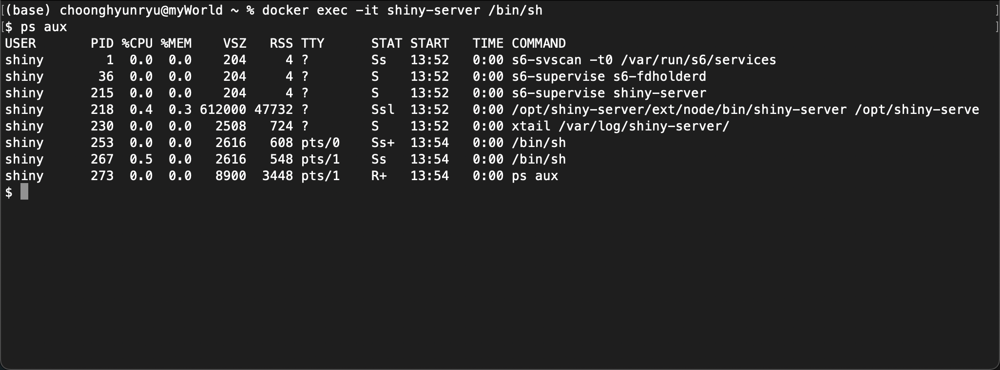
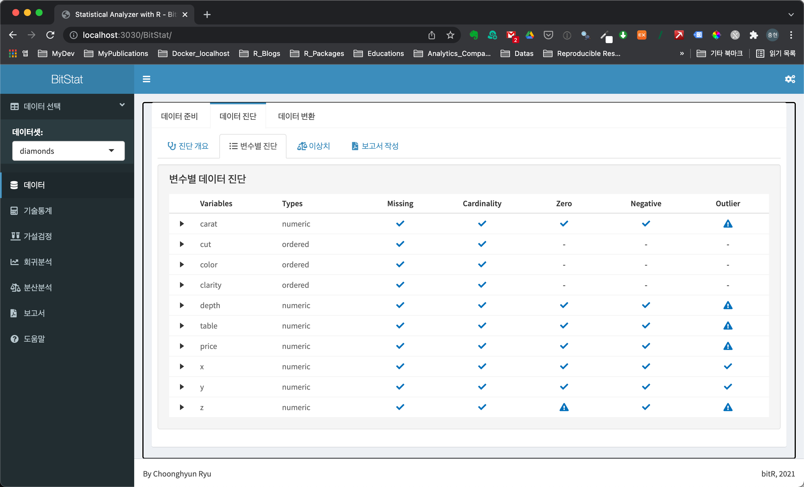

```{r setup, include=FALSE}
knitr::opts_chunk$set(echo = TRUE, 
                      message = FALSE, 
                      warning = FALSE, 
                      collapse = FALSE,
                      fig.align = "center")

library(shiny)
library(htmltools)

xaringanExtra :: use_panelset()
```

## Dockerfile 만들기
이제 완전하게 Shiny 애플리케이션이 운용될 docker 컨테이너를 만들고 실행할 차례입니다.

Makefile이 C/C++로 개발된 소스를 컴파일하고 배포하는 make의 룰을 정의한 파일이라면, Dockerfile은 docker 이미지를 생성하는 방법을 정의한 파일입니다. Dockerfile을 이용하면, 컨테이너 내부에 유틸리티, 개발 라이브러리나 R 패키지를 설치할 수 있습니다. 즉 rocker/shiny-verse 이미지에서 지원하지 못했던, 애플리케이션을 실행시키는데 필요한 패키지를 설치할 수 있습니다.

### 명령어의 이해

Dockerfile에 사용하는 대표적인 명령어는 다음과 같습니다.

* FROM  
  - 베이스(base) 이미지를 가져옵니다.
* RUN
  - 설치된 베이스 이미지 파일시스템의 운영체제에서 쉘 스크립트(shell script)를 실행합니다.
* COPY
  - 호스트에 있는 디렉토리나 파일을 docker 이미지 파일 시스템으로 복사합니다.
* EXPOSE
  - 컨테이너로 들어오는 트래픽을 리스닝할 프로토콜과 포트를 설정합니다.
* USER
  - 명령어를 수행할 사용자 계정을 지정합니다.
  - USER 명령어 이후부터 적용되며, 이미 생성된 계정이어야 합니다.
  
###  BitStat를 운영하기 위한 Dockerfile 파일
다음과 같은 내용의 Dockerfile 파일을 작성합니다. 의외로 설치하는 R 패키지가 많은 이유는, BitStat뿐만 아니라 개인적으로 만든 여러 개의 Shiny 애플리케이션을 이 환경에서 구동하기 위함입니다.  

```{r, eval=FALSE, echo=TRUE}
FROM rocker/shiny:latest

# system libraries of general use
RUN apt-get update && apt-get install -y \
    libxml2-dev \
    libcairo2-dev \
    libsqlite3-dev \
    openjdk-11-jdk \
    liblzma-dev \
    libbz2-dev \
    libssl-dev \
    curl

RUN curl -L http://bit.ly/google-chrome-stable -o google-chrome-stable.deb && \
    apt-get -y install ./google-chrome-stable.deb && \
    rm google-chrome-stable.deb

# install R packages required
RUN R -e "install.packages('rJava',              repos = 'http://cran.rstudio.com/')"
RUN R -e "install.packages('dlookr',             repos = 'http://cran.rstudio.com/')"
RUN R -e "install.packages('shinyjs',            repos = 'http://cran.rstudio.com/')"
RUN R -e "install.packages('shinydashboard',     repos = 'http://cran.rstudio.com/')"
RUN R -e "install.packages('shinydashboardPlus', repos = 'http://cran.rstudio.com/')"
RUN R -e "install.packages('shinyWidgets',       repos = 'http://cran.rstudio.com/')"
RUN R -e "install.packages('shinybusy',          repos = 'http://cran.rstudio.com/')"
RUN R -e "install.packages('shinythemes',        repos = 'http://cran.rstudio.com/')"
RUN R -e "install.packages('shinycssloaders',    repos = 'http://cran.rstudio.com/')"
RUN R -e "install.packages('colourpicker',       repos = 'http://cran.rstudio.com/')"
RUN R -e "install.packages('htmltools',          repos = 'http://cran.rstudio.com/')"
RUN R -e "install.packages('htmltools',          repos = 'http://cran.rstudio.com/')"
RUN R -e "install.packages('reactable',          repos = 'http://cran.rstudio.com/')"
RUN R -e "install.packages('glue',               repos = 'http://cran.rstudio.com/')"
RUN R -e "install.packages('xlsx',               repos = 'http://cran.rstudio.com/')"
RUN R -e "install.packages('flextable',          repos = 'http://cran.rstudio.com/')"
RUN R -e "install.packages('googleVis',          repos = 'http://cran.rstudio.com/')"
RUN R -e "install.packages('readr',              repos = 'http://cran.rstudio.com/')"
RUN R -e "install.packages('forcats',            repos = 'http://cran.rstudio.com/')"
RUN R -e "install.packages('plotly',             repos = 'http://cran.rstudio.com/')"
RUN R -e "install.packages('DBI',                repos = 'http://cran.rstudio.com/')"
RUN R -e "install.packages('waffle',             repos = 'http://cran.rstudio.com/')"
RUN R -e "install.packages('RSQLite',            repos = 'http://cran.rstudio.com/')"
RUN R -e "install.packages('remotes',            repos = 'http://cran.rstudio.com/')"
RUN R -e "install.packages('dbplyr',             repos = 'http://cran.rstudio.com/')"
RUN R -e "install.packages('ggthemes',           repos = 'http://cran.rstudio.com/')"
RUN R -e "install.packages('treemapify',         repos = 'http://cran.rstudio.com/')"
RUN R -e "install.packages('sparkline',          repos = 'http://cran.rstudio.com/')"
RUN R -e "install.packages('formattable',        repos = 'http://cran.rstudio.com/')"
RUN R -e "install.packages('DT',                 repos = 'http://cran.rstudio.com/')"
RUN R -e "install.packages('tidyverse',          repos = 'http://cran.rstudio.com/')"
RUN R -e "remotes::install_github('dreamRs/shinytreeview')"

COPY google-chrome /usr/local/bin/

USER shiny  
COPY Renviron /.Renviron
```

### 베이스 이미지 가져오기
다음 **FROM 명령어**는 docker hub에서 'rocker/shiny' 이미지의 최신 버전(lasett)을 가져오라는 의미입니디. 이 이미지를 베이스 이미지로 사용할 것입니다. 이미 앞에서 사용했던 이미지입니다.

```{r, eval=FALSE, echo=TRUE}
FROM rocker/shiny:latest
```

### 개발 라이브러리 설치하기
다음 **RUN 명령어**는 컨테이너 안의 파일시스템에서 Shell 명령어를 수행하라는 의미입니다.

apt-get(Advanced Packaging Tool)은 우분투(Ubuntu)를 포함한 데이안(Debian) 계열의 리눅스 배포본에서의 시스템 패키지 관리 유틸리티입니다. 
이 유틸리티로 개발 라이브러리나 시스템 유틸리티를 설치합니다.

다수의 R 패키지는 시스템 유틸리티나 동적 라이브러리를 인터페이스하여 구현합니다. 
예를 들면 RSQLite라는 R 패키지는 sqlite3의 동적 라이브러리를 사용합니다. 그래서 R 환경에서 sqlite를 사용하는 RSQLite 패키지는 개발 라이브러이인 libsqlite3-dev을 설치해야 합니다.

R 패키지에서 설치하기 까다로운 **rJava 패키지**는 JVM(Java Virtual Machine)을 인터페이스하기 위해서 JDK를 설치해야 합니다. 이를 위해서 JDK 11 버전인 openjdk-11-jdk를 설치합니다.

그리고 인터넷을 통해 공유하는 파일을 가져오기 위해서는 curl이 필요할지도 모릅니다.

이를 위해서 'apt-get update && apt-get install -y' 명령어 구문으로 개발 라이브러리와 시스템 유틸리티를 설치합니다. 

```{r, eval=FALSE, echo=TRUE}
# system libraries of general use
RUN apt-get update && apt-get install -y \
    libxml2-dev \
    libcairo2-dev \
    libsqlite3-dev \
    openjdk-11-jdk \
    liblzma-dev \
    libbz2-dev \
    libssl-dev \
    curl
```

```{r, sol-1, echo=FALSE}
div(class = "bg-blue", 
    h4(icon("lightbulb", style = "margin-right: 5px;"), 
       "크롬(Chorme) 설치", style = "margin-bottom: 10px; margin-top: 0px;"), 
    "BitStat는 pdf 보고서를 생성하기 위해서 pagedown 패키지를 사용합니다. 그런데 이 패키지는 크롬(Chrome)을 이용해서 웹 페이지를 pdf 파일로 변환합니다.", br(),
    "그래서 컨테이너에 리눅스용 크롬 브라우저를 설치해야 합니다.")
```

<br>

다음처럼 curl을 이용해서 크롬을 다운로드한 후 설치하고 삭제합니다. 이를 위해서 앞에서 apt-get로 curl을 설치한 것입니다.

```{r, eval=FALSE, echo=TRUE}
RUN curl -L http://bit.ly/google-chrome-stable -o google-chrome-stable.deb && \
    apt-get -y install ./google-chrome-stable.deb && \
    rm google-chrome-stable.deb
```

### R 패키지 설치하기
다음 **RUN 명령어**는 **R 유틸리티**로 R 패키지를 설치합니다. -e 옵션은 R이 수행할 R 스크립트를 지정하는 옵션입니다. 따옴표 안의 R 스크립트로 패키지를 설치하게 됩니다.

```{r, eval=FALSE, echo=TRUE}
RUN R -e "install.packages('rJava', repos = 'http://cran.rstudio.com/')"
```

### 포트지정
컨테이너가 사용할 포트를 지정하기 위해서 **EXPOSE** 명령어를 사용하지 않아도 됩니다. 베이스 이미지로 'rocker/shiny'를 사용했기 때문입니다. 이 베이스 이미지에 이미 **EXPOSE** 명령어로 3838 포트를 컨테이너가 사용할 수 있도록 설정되어 있기 때문입니다.

### 사용자 전환
root 권한으로 컨테이너를 실행하면, 무제한의 권한이 부여되므로, 보안 측면에서 취약할 수 있습니다. 그래서 다음처럼 일반 사용자인 shiny 사용자 계정으로 컨테이너를 실행하도록 설정합니다.

이지 베이스 이미지인 rocker/shiny-verse에서 shiny라는 그룹과 사용자를 만들어 놓았기 때문에 해당 사용자 계정을 만들 필요는 없습니다.

```{r, eval=FALSE, echo=TRUE}
USER shiny
```


## docker 이미지 생성

### 크롬을 위한 설정
pagedown 패키지가 크롬을 사용한다는 것을 앞에서 언급했습니다. 그런데 pagedown::chrome_print()가 크롬을 호출할 때, 다음처럼 "Error in is_remote_protocol_ok: Cannot find headless Chrome after 20 attempts"라는 에러가 발생합니다.

```{r, eval=FALSE, echo=TRUE}
output file: diagnosis_paged_temp.knit.md


Output created: diagnosis_paged_temp.html
Warning: Error in is_remote_protocol_ok: Cannot find headless Chrome after 20 attempts
  1: runApp

Execution halted
```

크롬은 **'샌드박스(sandbox)'**라는 보안 개념을 적용합니다. 크롬은 브라우저에서 여러 개의 독립된 탭을 띄우고, 별도의 웹 페이지가 실행됩니다. 별도로 독립된 프로세스가 가동하는 것으로 이들 프로세스는 샌드박스처럼 격리되어서 서로 관여하지 못합니다. 즉, 어느 탭의 웹 페이지에서 악성코드가 침투하거나, 버그 또는 장애로 해당 탭의 페이지가 먹통되어도 다른 탭의 웹 페이지는 정상적으로 동작합니다.

앞에서의 에러는 크롬의 샌드박스 기능에 기인합니다. 이 에러는 해결하기 위해서는 컨테이너에서 pagedown::chrome_print()가 크롬을 호출할 때, 샌드박스의 기능을 비활성해야 합니다.

이를 위한 몇 가지 솔루션이 있습니다.

<br>

1. pagedown::chrome_print() 함수 호출 수정
  - extra_args 인수값에 c("--no-sandbox")를 기술하여 호출
  - dlookr 패키지를 수정해야 함
2. 크롬 실행 시 옵션 정의
  - --no-sandbox 옵션 추가
  
<br>

여기서는 2번 솔루션을 적용합니다.

다음과 같은 스크립트를 담은 google-chrome 파일을 ./shiny-docker 경로에 생성합니다.

```{r, eval=FALSE, echo=TRUE}
#!/bin/bash

/usr/bin/google-chrome --no-sandbox $*
```

그리고 호스트에서 이 파일의 권한을 설정합니다. shiny 계정으로 컨테이너를 실행하기 때문에 755 권한을 부여해야 합니다.

```{r, eval=FALSE, echo=TRUE}
chmod 755 google-chrome
```

다음으로 다음과 같은 스크립트를 담은 Renviron 파일을 ./shiny-docker 경로에 생성합니다.

```{r, eval=FALSE, echo=TRUE}
PATH="/:${PATH}"
```

그리고 Dockerfile 파일에서 이들을 다음처럼 컨테이너에 복사합니다.

```{r, eval=FALSE, echo=TRUE}
COPY google-chrome /usr/local/bin/
COPY Renviron /.Renviron
```

### docker 이미지 생성

앞에서 만든 Dockerfile는 ./shiny-docker 경로에 저장했습니다. 이 Dockerfile을 빌드해서 docker 이미지를 생성합니다. 

build 명령어로 이미지를 생성합니다. -t 옵션은 생성할 이미지의 이름을 지정합니다. 이미지 이름을 'shiny'로 지정했습니다.

```{r, eval=FALSE, echo=TRUE}
docker build -t shiny:first ./shiny-docker
```

## 컨테이너 생성 및 실행

### 기존 컨테이너와 이미지 삭제
이제 앞에서 만들었던 'rocker/shiny-verse' 이미지와 'shiny-server' 컨테이너는 필요가 없어졌습니다. 그래서 다음처럼 컨테이너와 이미지를 차례대로 삭제합니다.

```{r, eval=FALSE, echo=TRUE}
docker rm -f shiny-server
docker rmi rocker/shiny-verse
```

### 컨테이너 생성 및 실행 

이번에는 Docker Desktop를 이용해서 컨테이너를 생성하고 실행합니다.
다음은 **Optional Settings 다이얼로그 창**에서의 환경설정 내용입니다.

* Container Name: shiny-server
* Ports:
  - Local Host: 3838
  - Container Port: default
* BitStat 애플리케이션 Path
  - Host Path: BitStat 애플리케이션이 있는 호스트 경로
  - Container Path: /srv/shiny-server
* BitStat 애플리케이션 Path
  - Host Path: Shiny 서버 로그를 저장할 호스트 경로
  - Container Path: /var/log/shiny-server  



다음 명령도로 동일한 기능을 수행합니다. --name 옵션은 컨테이너의 이름을 지정합니다.
-p, -v는 각각 포트와 볼륨을 정의합니다.

```{r, eval=FALSE, echo=TRUE}
docker run -d -p 3838:3838 --name shiny-server \
    -v /Users/choonghyunryu/shiny-server/:/srv/shiny-server/ \
    -v /Users/choonghyunryu/Documents/99_logs/shiny/:/var/log/shiny-server/ \
    shiny:first
```

컨테이너를 실행한 후 콘솔로 들어가서 프로세스를 확인하면, 다음처럼 shiny 계정으로 shiny 서버 프로세스가 실행되었음을 확인할 수 있습니다.



## BitStat 애플리케이션 실행

이제는 http://localhost:3838/BitStat/ URL로 BitStat 애플리케이션을 실행할 수 있습니다.

실행된 BitStat 애플리케이션 화면은 다음과 같습니다.



## 결언

이제 docker 환경에서 BitStat 애플리케이션을 실행할 수 있습니다. 추가로 개발하는 Shiny 애플리케이션은 앞에서 정의한 로컬 호스트의 /Users/choonghyunryu/shiny-server/ 디렉토리에 배포하면 됩니다.

어느 정도 목적하는 환경의 Shiny 서버를 구동하려면, 결국은 docker 이미지를 만들어야할 수 밖에 없습니다. 개인적으로 Shiny 애플리케이션의 데모 환경을 만들려는 목적으로 시도한 작업입니다만, docker의 매력을 느끼기에 충분했습니다.

R과 Shiny를 사용하기에는 MS-Windows 환경이 부족함이 없지 않습니다. 여러 사람들과 협업을 하기 위해서는 동일한 환경에서의 작업이 중요합니다. 이런 대안으로 docker 환경에서 R과 Shiny를 사용하는 것이 유용한 대안이 될 것 같습니다.


